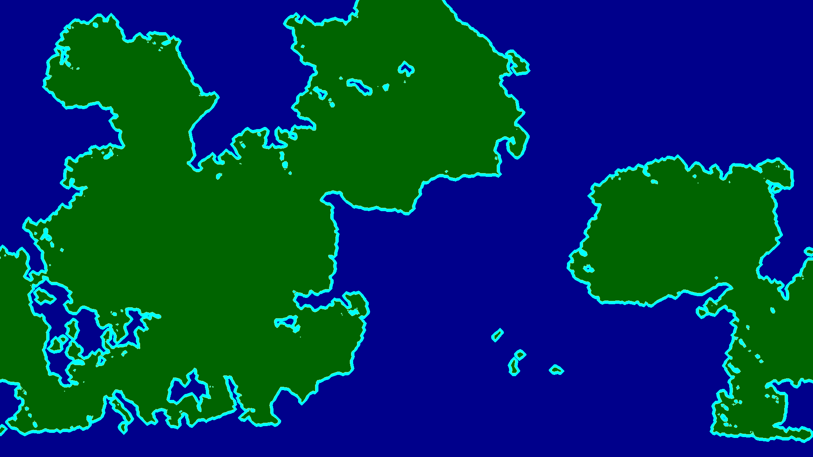
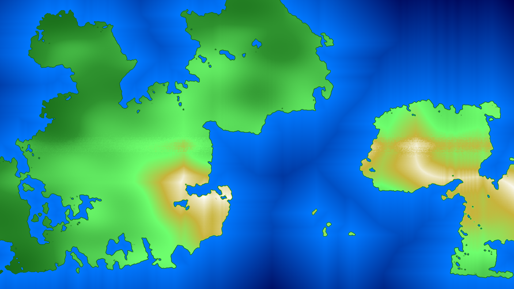
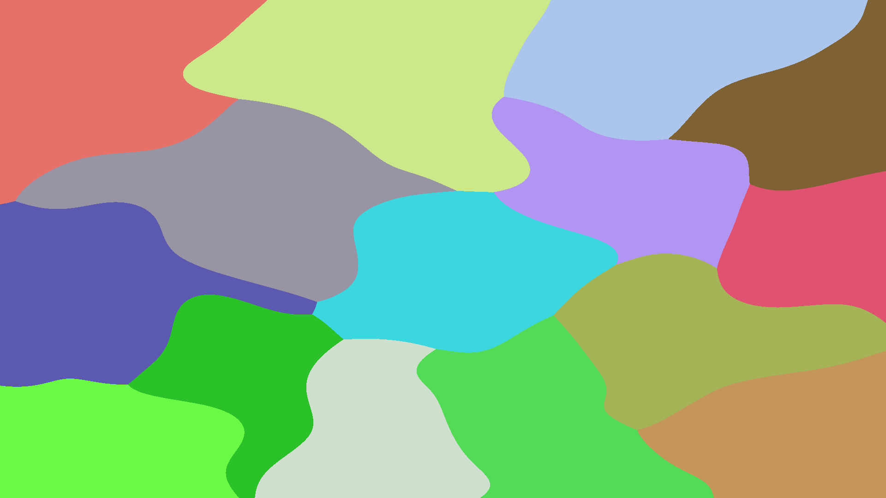
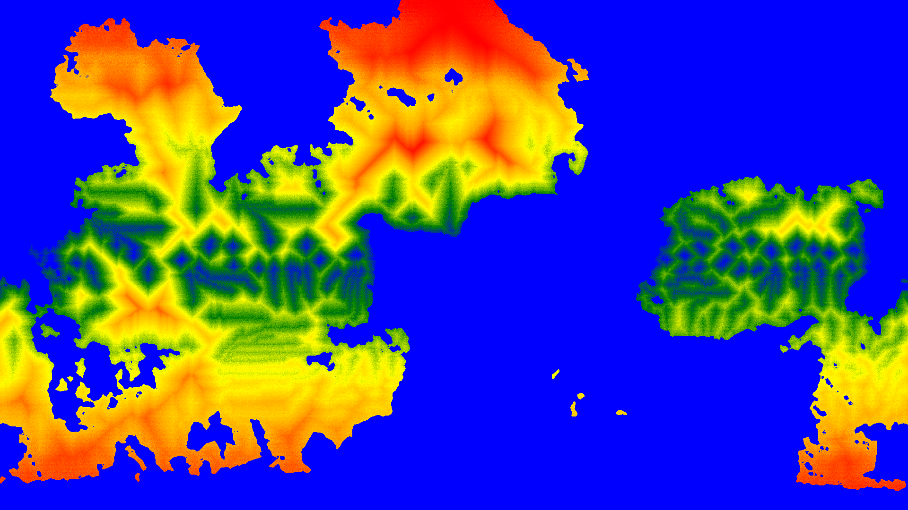
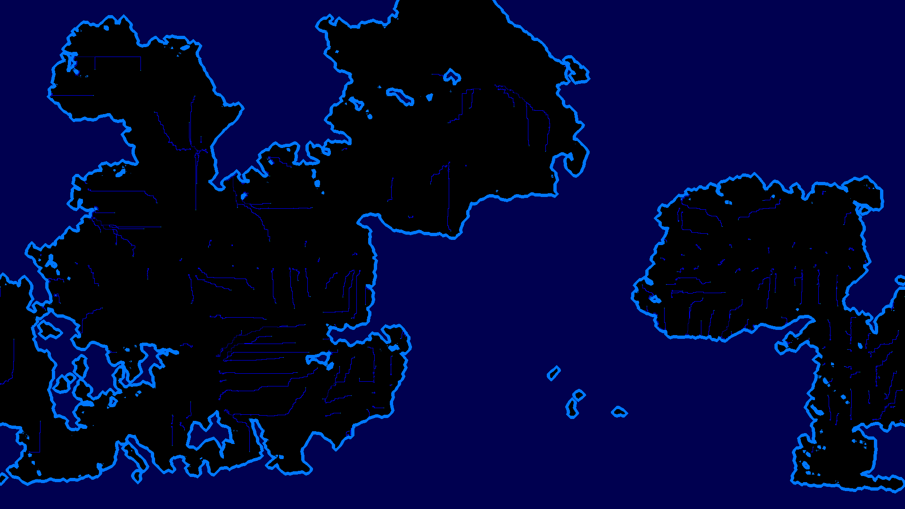
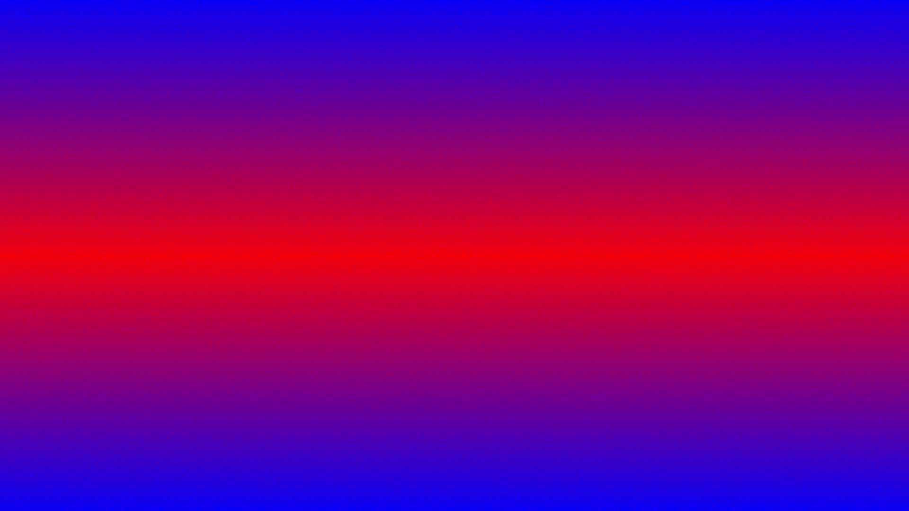

# CubicCube-Map-Generator
Large-Scale Earth-Like World Generator for Voxel 3D Games.

🌎 **Languages:** [English](README.md) | [Português](README.pt-BR.md)

The Cubic³ Map Generator is a procedural world generation system developed specifically for the game Cubic³, currently in development by Momentum.

Its purpose is to serve as the foundational world generation layer of the game, enabling the creation of massive, navigable, chunk-based maps, with earth-like continental structures, suitable for a voxel 3D game.

## Project Goal
This project was created to solve a core problem in the development of Cubic³:

How to generate an extremely large, continuous, and navigable voxel world without relying exclusively on noise-based techniques or Wave Function Collapse, while preserving global geographic coherence?

The generator operates at a global scale, producing a deterministic base world map that is later consumed by the voxel chunk generation system.

## Generation Pipeline

The generator operates through a configurable central pipeline, responsible for executing all stages of world generation.

### Pipeline Output Options

The main pipeline provides two mutually exclusive options, configurable at the entry point (Program.cs):

1. Image Export (Visualization)
* Generates images of the final map (and intermediate maps).
Used for:
* Visual debugging.
* Parameter tuning.
* Validation of continents, terrain, and climate.
* Uses direct data-to-pixel conversion.

Ideal during development and generator balancing.

2. Structural Export (For UnityEngine)
* Exports all generated maps as data structures.
* Designed for direct import into the Unity Engine.
* Does not rely on image conversion.
* Preserves full data precision.
* These data are consumed directly by the game's voxel chunk generation system.
* This is the production mode, used by Cubic³.

## Why Not Use Only Noise or WFC?

### Noise-Based Techniques (Perlin / Simplex / FBM)

* Excellent for local variation

Major drawbacks at global scale:
* Lack of well-defined continents
* Excessively chaotic terrain
* Poor long-distance navigability

### Wave Function Collapse

* High computational cost
* Does not scale well for large continuous worlds
* Limited control over macro-scale geography

Cubic³ required a macro-structure-first approach, defining continents, terrain, and climate before voxel-level generation.

## Abordagem Técnica

### Projeção planar

A projeção planar foi escolhida para facilitar o uso do mapa na geração de chunks, também servindo como dados iniciais de minimizar posteriormente.
Foi considerada a geração já com distorção cúbica ou esférica, mas foi decidido planar pois permite mais liberdade criativa para os designers. Além disso, também é possível realizar a distorção facilmente na Unity Engine caso seja necessário.

A modelagem do mundo é realizada com listas de dados contendo:
* Altitude.
* Dados continentais.
* Temperatura.

Essa abordagem:
* Facilita indexação espacial.
* Escala bem para mapas grandes.
* Serve como base natural para chunking voxel.

## Continentes Earth-Like

### Massas Continentais Coesas
* Continentes gerados como blobs contínuos.

Controle explícito de:
* Escala.
* Distribuição.
* Densidade.

### Tectônica Simplificada

* Simulação de placas em escala macro.

Criação natural de:
* Cadeias montanhosas.
* Planícies.
* Fronteiras continentais.

O objetivo não é aleatoriedade visual, mas navegabilidade e identidade geográfica.

## Desempenho e otimização

O Cubic³ Map Generator foi projetado desde o início com desempenho e escalabilidade em mente, considerando o impacto direto que a geração de mundo tem no pipeline de um jogo voxel 3D.

### Paralelização e Multithreading

Diversas etapas da geração foram paralelizadas utilizando multithreading, permitindo:
* Execução simultânea de tarefas independentes
* Melhor aproveitamento de CPUs multi-core
* Redução significativa do tempo total de geração

Entre as etapas paralelizadas estão:
* Processamento de mapas de altitude
* Cálculo de temperatura
* Aplicação de erosão

Essa abordagem garante que o sistema escale bem conforme o tamanho do mapa aumenta.

### Resultados de Performance

O gerador foi testado em diversas máquinas com diferentes configurações de hardware, apresentando tempos de geração consistentes:

* Tempo mínimo: ~8 segundos
* Tempo máximo: ~17 segundos

Esses valores consideram a geração completa do mapa global, incluindo continentes, relevo, erosão e dados climáticos.

O desempenho obtido é adequado tanto para pré-processamento offline, quanto para uso integrado ao pipeline de desenvolvimento do jogo.

## Exemplo de Mapas Gerados

Abaixo está um exemplo de mapas produzidos pelo Cubic³ Map Generator, utilizados tanto para validação visual quanto para debug e ajuste de parâmetros durante o desenvolvimento.

### Mapa Continental



### Mapa de Altitude



### Mapa de Placas Tectônicas



### Mapa de Precipitação



### Mapa de Rios e Corpos Aquáticos



### Mapa de Temperatura



### Mapa de Biomas (Final)


As imagens são geradas automaticamente pelo próprio sistema através do modo de exportação visual da pipeline.

## Macro → Micro (World → Chunks)

O sistema é dividido em duas camadas bem definidas:

### Camada Global (Realizada nessa aplicação)
* Define continentes.
* Altitude média.
* Temperatura.
* Clima base.

### Camada Local
* Chunks voxel consultam o mapa global.
* Geração determinística por seed.
* Continuidade garantida entre regiões.

Essa separação permite:
* Geração sob demanda.
* Baixo custo de memória.

## Erosão e Suavização
Após a geração inicial:
* Algoritmos de erosão reduzem artefatos.
* Criam transições naturais.
* Melhoram jogabilidade voxel.

## Sistema de Temperatura
A temperatura é calculada com base em:
* Latitude.
* Altitude.

Esses dados influenciam:
* Biomas futuros.
* Variação climática.
* Geração voxel contextual.

## Estrutura do Projeto
```text
Cubic³MapGenerator/
├── Program.cs                # Pipeline principal de geração
├── Seed.cs                   # Processamento de Seed para utilização na geração
│
├── Maps/
│   ├── Tectonics.cs          # Geração tectônica
│   ├── HeightMap.cs          # Altitude global
│   ├── Erosion.cs            # Suavização e erosão
│   ├── Temperature.cs        # Mapa de temperatura
│   ├── ContinentalData.cs    # Dados de massas continentais
│   ├── BiomeMap.cs           # Geração do mapa final de biomas
│   ├── Precipitation.cs      # Mapa de precipitação
│   └── Rivers.cs             # Geração de rios e corpos de água
│
├── ContinentBlob.cs          # Criação dos dados dos Blobs de continentes
├── DataImageConverter.cs     # Conversão de imagens em dados
└── Cubic³MapGenerator.csproj
```

## Tecnologias e Técnicas

* C# / .NET
* Geração Procedural
* Modelagem Geográfica
* Paralelização e Multithreading
* Simulação tectônica através de Voronoi
* Separação Macro vs Micro Geração
* Determinismo por seed

## Papel no Desenvolvimento do Cubic³
Este gerador:
* Define a geografia global do jogo
* Alimenta diretamente a Unity Engine
* Garante coerência entre chunks voxel
* Serve como base para sistemas futuros

Ele é parte essencial da engine de world generation do Cubic³.

## Nota Final
Este projeto foi desenvolvido sob medida para um jogo real em produção, priorizando escala, controle técnico e integração direta com a engine.
